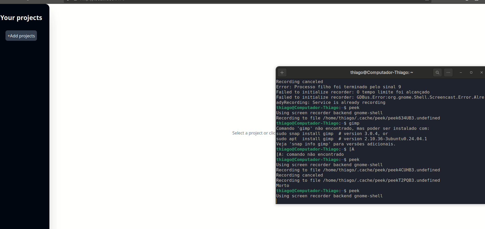

# 📌 TaskList - Gerenciador de Projetos e Tarefas

Aplicação desenvolvida em **React + TypeScript** baseada no curso do _Maximilian Schwarzmüller (Udemy)_, com a ideia de gerenciar **projetos** e suas **tarefas**.

## 🚀 Funcionalidades

- ✅ Criar, editar e excluir **projetos**
- ✅ Adicionar e remover **tarefas** associadas a cada projeto
- ✅ Selecionar um projeto para visualizar suas **tasks**
- ✅ Interface simples e responsiva utilizando **TailwindCSS** e **shadcn/ui**

## 🛠️ Tecnologias utilizadas

- [React](https://react.dev/)
- [TypeScript](https://www.typescriptlang.org/)
- [Vite](https://vitejs.dev/)
- [TailwindCSS](https://tailwindcss.com/)
- [shadcn/ui](https://ui.shadcn.com/)

## Demonstração

